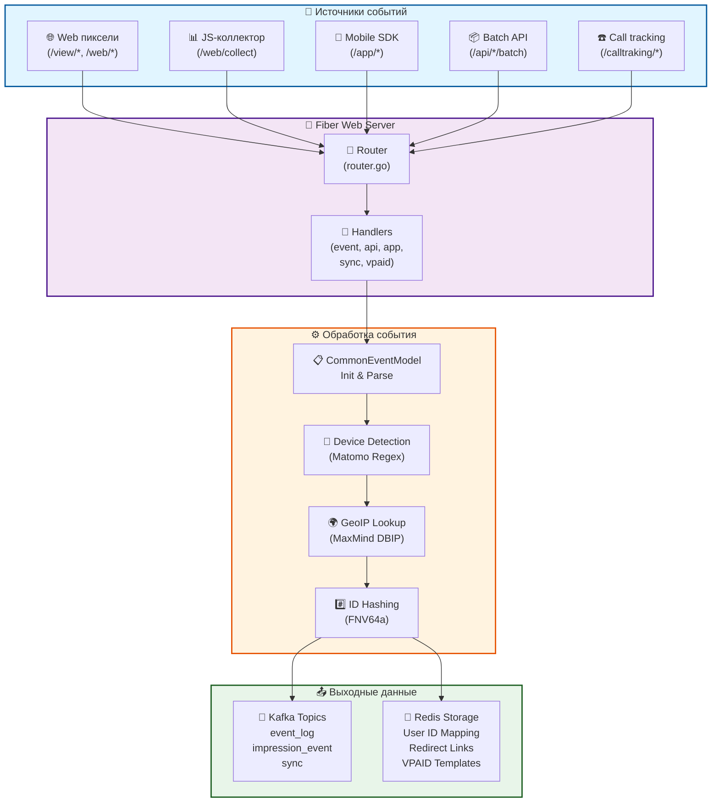

# 🎯 TargetADS Event API

Высокопроизводительный сервер сбора и обработки событий для рекламных кампаний TargetADS. Сервис принимает пиксельные и JSON‑запросы с веб-сайтов, мобильных приложений, внешних API и систем коллтрекинга, нормализует данные, обогащает информацию о user agent и геолокации, отправляет события в Kafka и синхронизирует идентификаторы пользователей через Redis.

**Docker Repo**: `cr.yandex/crp8ptgf4p7fbsbn47it/eventapi:1.1.59`
export GOPATH=/Users/mr.markov/go
export PATH=GOPATH/bin:GOPATH/bin:GOPATH/bin:PATH

---

## ✨ Основные возможности

- **Приём пиксельных событий** через unified API (`/view/pixel`, `/view/click`, `/web/pixel`) для impression/click/page_view из веб-баннеров и скриптов
- **JavaScript-коллектор** (`/web/collect`) для отправки событий с веб-страниц с автоматической генерацией `device_id`
- **Офлайн-события и батчи** через REST API (`/api/project/event/upload`, `/api/project/event/upload/batch`) до 1000 событий в одном запросе
- **Интеграция мобильных платформ** (AppMetrica, AppsFlyer, Adjust) с автоматическим преобразованием их форматов данных
- **Cookie sync** с внешними партнёрами (Yandex, OMI, ONIIT, Tiburon) и отправкой синхронизированных ID в отдельный Kafka топик
- **VPAID контент-сервис** для доставки XML-шаблонов видео-объявлений с кешированием в Redis
- **Встроенное обнаружение** платформ и ботов через Matomo Device Detector и Geo IP через MaxMind DBIP
- **Асинхронная отправка** в Kafka с настраиваемой буферизацией (5000 сообщений или 1 сек)
- **Redis-кеширование** для ссылок, VPAID-шаблонов и соответствия мобильных device ID к user ID
- **JSON-логирование** в STDOUT с поддержкой уровней Debug/Info/Error для мониторинга

---

## 🧱 Архитектура и поток данных



---

### 📊 Этапы обработки события

| Этап | Компонент | Описание | Входные данные | Выходные данные |
| :---: | --- | --- | --- | --- |
| **1️⃣ Приём** | Fiber Router | Маршрутизация входящего запроса к соответствующему handler | HTTP GET/POST | Fiber Context |
| **2️⃣ Парсинг** | CommonEventModel.Init() | Извлечение параметров из query/body, инициализация структуры | Query/Body параметры | Заполненный event объект |
| **3️⃣ Обнаружение** | Device Detector + IP GeoIP | Определение платформы, браузера, ОС, страны, города | User-Agent + IP адрес | DeviceType, Browser, GeoInfo |
| **4️⃣ Хеширование** | FNV64a Hash | Вычисление хешей для ID пользователей | Строковые ID | uint64 хеши |
| **5️⃣ Отправка** | Kafka Producer | Асинхронная отправка события в топик | Serialized JSON | Kafka message offset |
| **6️⃣ Кеширование** | Redis Storage | Сохранение данных для последующего использования | Ключ + значение | Stored in Redis |

---

### Основные модули

| Модуль | Файлы | Назначение |
| --- | --- | --- |
| **Инициализация** | `main.go` | Создание Fiber приложения с настройками буфера (16KB read, 8MB body), инициализация логгера (`log/slog`), подключение к Redis, Kafka, graceful shutdown при Ctrl+C/SIGTERM |
| **Конфигурация** | `config/config.go` | Чтение переменных окружения из `.env`/`.envProduction`, создание `ConfigStruct` с параметрами Kafka, Redis, cookies, лог-уровнями |
| **Маршрутизация** | `router/router.go` | Регистрация групп маршрутов `/view`, `/web`, `/api`, `/app`, `/sync`, `/calltraking`, `/content` с соответствующими handlers |
| **Обработчики событий** | `handler/event/event.go` | Парсинг пиксельных запросов и JSON-коллектора, инициализация `CommonEventModel`, отправка в Kafka, возврат `device_id` для POST запросов |
| **API обработчики** | `handler/api/api.go` | Приём одиночных и batch офлайн-событий, валидация до 1000 элементов, проверка обязательных полей для ecommerce |
| **Мобильные приложения** | `handler/app/mobileApp.go` | Парсинг вебхуков от AppMetrica, AppsFlyer, Adjust с преобразованием в `CommonEventModel` |
| **Cookie Sync** | `handler/sync/sync.go` | Синхронизация идентификаторов с Yandex, OMI, ONIIT, Tiburon партнёрами, отправка в Kafka топик `sync` |
| **Коллтрекинг** | `handler/calltracking/calltracking.go` | Приём событий от Call Touch и преобразование в стандартный формат событий |
| **VPAID сервис** | `handler/vpaid/vpaid.go` | Доставка VPAID XML шаблонов из Redis с fallback на CDN |
| **Модели данных** | `model/model.go`, `model/*_model.go` | `CommonEventModel` — центральная структура всех событий, `SyncIDs`, AppMetrica/AppsFlyer/CallTouch специфичные модели с easyjson генерацией |
| **Redis хранилище** | `storage/storage.go` | Подключение UniversalClient с поддержкой Sentinel, методы Get/Set для кеширования redirect ссылок и VPAID |
| **Redis для пользователей** | `storage/users.go` | Отдельное хранилище для userId с LRU-кешем в памяти (избегает частых обращений в Redis) |
| **Kafka producer** | `kafka/kafka.go` | Async producer Sarama с параметрами: 5000 сообщений flush, 1 сек timeout, RequiredAcks=1 |
| **SCRAM аутентификация** | `kafka/scram.go` | Поддержка SASL/SCRAM-SHA-512 для защищённого подключения к Kafka |
| **Device Detection** | `devicedetector/detector.go` | Wrapper над Matomo Device Detector с LRU кешем на 100K результатов, определение browser/OS/device type/bot |
| **IP Detection** | `iptetected/ipdetected.go` | Loader MaxMind DBIP базы в `init()` и функция `IpDetected()` для получения geo, ISP, connection type |
| **Утилиты** | `utils/helpers.go`, `utils/*.go` | FNV hash для ID, URL/Domain валидация, cookie management, platform detection, конвертация типов |
| **Мониторинг** | `monitoring/prometheus.go` | Prometheus middleware для Fiber (по умолчанию закомментирована) на `/metrics` порту 9090 |

---

## 📡 REST API Endpoints

### Группа `/view` — Пиксельные события (impression/click)

```go
view.Get("/pixel", eventHandler.ProcessingEvent(log, userStorage))   // impression
view.Get("/click", eventHandler.ProcessingEvent(log, userStorage))   // click с redirect
```

**GET `/view/pixel`** — Impression пиксель
```bash
curl "http://localhost:8080/view/pixel?pid=12486&cn=175&pl=331&domain=example.com&yandexuid=7085302434169552765&sid=sess-123"
```

Параметры:
- `pid` (обязателен) — Project ID
- `cn`, `pl` — Campaign ID, Placement ID для Media типа
- `domain` — Домен показа, валидируется функцией `utils.DomainValidate`
- `yandexuid`, `user_id` — Идентификаторы пользователя (опциональны)
- `sid` — Session ID
- Антифрод: `d` (duration), `vt` (video type), `p` (visible %), `w`/`h` (размеры), `ps` (position), `s` (scroll)

Ответ: `200 OK`, `Content-Type: image/gif`, бинарные данные `show.gif` (~35 байт) с cache-control заголовками.

**GET `/view/click`** — Click событие с redirect

Поддерживает параметры как `/pixel`, плюс `redirect` URL, который проверяется через `utils.ValidateURL`. Если валидная ссылка, происходит `c.Redirect(url, fiber.StatusFound)`.

### Группа `/web` — Веб-события (JS коллектор)

```go
web.Post("/collect", eventHandler.ProcessingEvent(log, userStorage))  // JSON body
web.Get("/pixel", eventHandler.ProcessingEvent(log, userStorage))     // img tag
```

**POST `/web/collect`** — Основной эндпоинт для JS-кода на страницах
```bash
curl -X POST "http://localhost:8080/web/collect?pid=12486" \
  -H "Content-Type: application/json" \
  -d '{
    "event_name": "page_view",
    "event_value": 1,
    "sid": "session-xyz",
    "dl": "/products",
    "dr": "https://google.com"
  }'
```

Особенность: handler возвращает `device_id` (uint64 как строка) для отслеживания на клиенте. В коде (`handler/event/event.go:26-28`):
```go
if event.SysType == model.WebSysType && c.Method() == "POST" {
    c.Set("Access-Control-Allow-Origin", c.Get("Origin"))
    return c.SendString(strconv.FormatUint(event.DeviceId, 10))
}
```

**GET `/web/pixel`** — Для старых браузеров или img-тегов, параметры в query-строке.

### Группа `/api` — Внешние API интеграции

```go
api.Post("/project/event/upload", apiHandler.ExternalEventApi(log, userStorage))       // 1 событие
api.Post("/project/event/upload/batch", apiHandler.ExternalEventApiBatch(log, userStorage)) // до 1000
```

**POST `/api/project/event/upload`** — Одиночное офлайн-событие
```bash
curl -X POST "http://localhost:8080/api/project/event/upload?pid=100" \
  -H "Content-Type: application/json" \
  -d '{
    "event_name": "purchase",
    "event_value": 4990.5,
    "uid": "external_user_1",
    "ecommerce": {
      "id": "order-123",
      "amount": 4990.5,
      "currency": "RUB"
    }
  }'
```

Ответ: `200 OK` или `400 Bad Request` с JSON ошибкой.

**POST `/api/project/event/upload/batch`** — Батч до 1000 событий
```bash
curl -X POST "http://localhost:8080/api/project/event/upload/batch?pid=100" \
  -H "Content-Type: application/json" \
  -d '[
    { "event_name": "purchase", "event_value": 1000, "uid": "user1" },
    { "event_name": "add_to_cart", "event_value": 500, "uid": "user2" }
  ]'
```

Ответ:
```json
{ "items_upload": 2 }
```

или с ошибками:
```json
{
  "items_upload": 1,
  "error_items": {
    "1": "event_name is required"
  }
}
```

### Группа `/app` — Мобильные интеграции

```go
mobileApp.Post("/appmetrika/collect", appHandler.AppMetrikaCollectPOST(log, userStorage))
mobileApp.Post("/appsflyer/collect", appHandler.AppsFlyerCollectPOST(log, userStorage))
mobileApp.Get("/adjust/collect", appHandler.AdjustCollect(log, userStorage))
```

**POST `/app/appmetrika/collect`** — Yandex AppMetrica вебхук

Yandex отправляет POST с JSON body. Handler парсит `AppMetrikaRequest` в `model/application/appMetrika.go`, извлекает:
```go
type AppMetrikaRequest struct {
    ProjectId      int64  `json:"app_id"`
    EventName      string `json:"event_name"`
    EventDatetime  string `json:"event_datetime"`
    UserAgent      string `json:"user_agent"`
    EventParams    string `json:"event_params"` // JSON string внутри
    // ... device_id варианты (gaid, idfa, uuid)
}
```

Функция `IdenId()` выбирает наиболее приоритетный ID (GAID > IDFA > UUID).

**POST `/app/appsflyer/collect`** — AppsFlyer вебхук

Аналогично AppMetrica, парсит `AppsFlyerRequest` и конвертирует в `CommonEventModel`.

**GET `/app/adjust/collect`** — Adjust tracking

Параметры передаются в query-строке, handler парсит через `c.QueryParser(&payload)`.

### Группа `/sync` — Cookie синхронизация

```go
sync.Get("/yandex", syncHandler.ProcessingCookieSyncYandex)
sync.Get("/omi", syncHandler.SynExternalPartnerOMI(log))
sync.Get("/onin", syncHandler.SynExternalPartnerONI(log))
sync.Get("/tiburon", syncHandler.SynExternalPartnerTiburon(log))
sync.Get("/partner", syncHandler.CookieSyncExternalPartner(log))
```

Каждый эндпоинт парсит query параметры вроде `uid`, `yid`, `partner_id`, создаёт `SyncIDs` структуру и отправляет в Kafka топик `sync`:
```json
{
  "ta_uniq_id": 12345,
  "yandex_id": 7085302434,
  "partner_id": "ext_123"
}
```

Ответ обычно `200 OK` или `302 Found` с redirect на партнёра.

### Группа `/calltraking` — Коллтрекинг события

```go
callTraking.Post("/calltouch/collect", calltracking.CallTouchCollectPost(log))
callTraking.Get("/calltouch/collect", calltracking.CallTouchCollectPost(log))
```

CallTouch отправляет данные о звонках. Handler конвертирует в `CommonEventModel` с `SysName = "CallTracking"`.

### Группа `/content` — VPAID контент

```go
vpaid.Get("/vpaid", vpaid2.GetVPAID(log, userStorage))
vpaid.Get("/vpaid.xml", vpaid2.GetVPAID(log, userStorage))
```

Возвращает VPAID XML из Redis ключа `vpaid:sid` или загружает с CDN, устанавливает `Content-Type: application/xml`.

---

## 🔄 Event Processing Flow (Обработка события)

### 1. Инициализация (Init)

Когда запрос попадает в handler, создаётся пустой `CommonEventModel{}` и вызывается метод `Init(c, log, userStorage)` (в `model/model.go`). Этот метод:

- **Парсит параметры**: из `c.Query()`, `c.Params()`, `c.BodyParser()` в зависимости от типа запроса
- **Устанавливает базовые данные**: `ProjectId`, `CampaignId`, `PlacementId`, `SessionId`, domain и т.д.
- **Генерирует device_id**: через `uuid.New().ID()` или из куки `config.Config.CookiesUserIdName`
- **Определяет платформу**:
  ```go
  if utils.IsAPP(c) { event.SysType = model.AppSysType }
  else if utils.IsTV(c) { event.SysType = model.TvPlatform }
  else { event.SysType = model.WebSysType }
  ```
- **Device Detection**: вызывает `devicedetector.Detect(userAgent)` и заполняет `BrowserName`, `BrowserVersion`, `DeviceType`, `OsName`, `OsVersion`, `UABot`
- **IP Detection**: парсит IP из заголовков, вызывает `ipdetected.IpDetected(ip)` и получает `Country`, `City`, `ConnectionType`
- **ID Hashing**: вычисляет FNV64a хеши для `CustomUserID`, `MobDeviceIDHashMD5`, `YandexId` через `utils.Hash64(id...)`
- **Валидация**:
  ```go
  if event.ProjectId == 0 { event.Error = errors.New("project id required") }
  if !utils.DomainValidate(event.Domain) { event.Error = ... }
  ```
- **Ecommerce**: если есть в body, парсит `Ecommerce` и `EcommerceItems`

### 2. Определение типа события (SysName)

На основе пути и параметров:
```go
if strings.Contains(c.Path(), "/click") {
    event.SysName = model.ClickSysName
} else if c.Query("iv") == "1" {
    event.SysName = model.VideoSysName
} else if len(event.Ecommerce.Items) > 0 {
    event.SysName = model.PurchaseSysName
} else {
    event.SysName = model.ImpressionSysName  // default
}
```

### 3. Отправка в Kafka (SendToKafka)

```go
if !event.NoSend {  // NoSend = true при ошибке валидации
    event.SendToKafka(log)
}
```

Метод сериализует `CommonEventModel` в JSON через easyjson (сгенерировано из `model_easyjson.go`):
```go
data, _ := easyjson.Marshal(event)
kafkaHandler.KafkaProducer.PushToKafkaMessage(
    config.Config.KafkaCustomEventName,  // топик: "event_log"
    data
)
```

Kafka producer работает асинхронно с параметрами:
```go
configProduce.Producer.RequiredAcks = 1         // wait for leader
configProduce.Producer.Flush.Messages = 5000    // буферизуй до 5000
configProduce.Producer.Flush.Frequency = 1 sec  // или отправь через 1 сек
```

### 4. Ответ клиенту

В зависимости от типа endpoint:
- **GET пиксель** (`/view/pixel`): `show.gif` (статический файл)
- **GET click** (`/view/click`): redirect на `event.GetRedirectLink()` (ищет в Redis по ключу `Shorter:pid|cn|pl`)
- **POST JSON** (`/web/collect`): строка `device_id`
- **API** (`/api/*`): `200 OK` или `400` с JSON ошибкой

---

## 🔐 Валидация и антифрод

### Device Detector — Определение платформы

`devicedetector/detector.go` использует embedded Matomo регулярные выражения (YAML из `regexes/`):
```go
cache, err := dd.NewEmbeddedCache()  // Loads from regexes/*.yml
detector := dd.NewDetector(cache)
result := detector.Parse(userAgent)
```

Результат кешируется в LRU на 100K записей:
```go
const uaCacheSize = 100000
uaCache, _ := lru.New[string, cachedResult](uaCacheSize)
```

Выглядит как:
```json
{
  "device_type": "desktop",
  "browser_name": "Chrome",
  "browser_version": "120.0.0.0",
  "os_name": "Windows",
  "os_version": "10",
  "is_bot": false
}
```

### IP GeoLocation — MaxMind DBIP

В `iptetected/init()` загружается база:
```go
ipModelDb, err := maxminddb.Open("src/geodb/dbip.mmdb")
```

Функция `IpDetected(ip)` парсит IP и возвращает:
```go
country, city, isp, organization, connType, userType, err := IpDetected("203.0.113.42")
// => "RU", "Moscow", "Rostelecom", "ISP", "residential", nil
```

### Антифрод параметры

В запросе могут приходить параметры:
```
ps (int64)  — Position: 0=top, 1=bottom, 2=center, 3=fullscreen
s  (int64)  — Scroll: 0=unknown, 1=no, 2=yes
td (int64)  — Time since script load (ms)
p  (uint64) — Visible percentage (0-100)
w, h        — Creative width/height (px)
d  (int64)  — Viewability duration (ms)
```

Они сохраняются в `CommonEventModel` и отправляются в Kafka для анализа на бэкенде.

### Валидация доменов и URL

```go
// utils/helpers.go
func DomainValidate(domain string) bool {
    // Проверяет формат доменного имени
    // Возвращает true если валидный
}

func ValidateURL(url string) bool {
    // Парсит URL и проверяет схему
    // Разрешены только http/https
}
```

---

## 💾 Хранилища данных

### Redis для Shorter (ссылок и VPAID)

Подключение:
```go
var Redis = NewRedisClient()

options := redis.UniversalOptions{
    Addrs:    config.Config.RedisADDR,  // []string{"localhost:6379"}
    Password: config.Config.RedisPass,
    DB:       0,
}
```

Использование:
- **Redirect ссылки**: ключ `Shorter:${pid}|${cn}|${pl}` → значение URL
- **VPAID**: ключ `vpaid:${sid}` → значение XML
- **Синхронное выполнение**: методы `Get()`, `Set()` работают с context и timeout 5 сек

Тест при инициализации:
```go
client.Set(context.Background(), "foo", "bar", 0)
val, _ := client.Get(context.Background(), "foo")
if val != "bar" {
    log.Error("Redis connection failed")
    os.Exit(1)
}
```

### Redis Sentinel для User Storage

В `storage/users.go`:
```go
type UsersRedisClient struct {
    client   redis.UniversalClient
    localLRU *lru.Cache[string, uint64]  // In-memory LRU 100K entries
}

NewUsersRedisClient(log) {
    if config.Config.RedisUserMasterName != "" {
        // Используется Sentinel
        options.Sentinel = &redis.SentinelOptions{...}
    }
    localLRU, _ := lru.New[string, uint64](100000)
}
```

Хранит соответствие `user_id_raw (string) → user_id (uint64)` для ускорения обработки мобильных событий.

### Kafka Topics

| Топик | Назначение | Сообщение |
| --- | --- | --- |
| `event_log` | Основной топик событий | JSON serialized `CommonEventModel` |
| `impression_event` | Отдельно импрессии (опционально) | JSON событие с type="impression" |
| `sync` | ID синхронизация | JSON с `ta_uniq_id`, `yandex_id`, партнёр ID |
| тестовые | Для разработки | Настраиваются в `.env` |

Отправка асинхронна через Sarama:
```go
message := &sarama.ProducerMessage{
    Topic: config.Config.KafkaCustomEventName,
    Value: sarama.StringEncoder(data),
}
p.saramaAsyncProducer.Input() <- message
```

Broker получит сообщение без гарантии доставки (RequiredAcks=1).

---

## ⚙️ Конфигурация и развёртывание

### Требования к окружению

- **Go**: версия 1.23 или выше (см. `go.mod: go 1.23.0`)
- **Kafka**: PLAINTEXT или SASL/SCRAM протокол, 1+ брокер
- **Redis**: стандартный или Redis Sentinel для HA
- **Файловая система**: DBIP база в `src/geodb/dbip.mmdb` (~80 MB), regex в `devicedetector/regexes/`
- **ОС**: Linux для prod, Windows/macOS для разработки

### Переменные окружения

Читаются из файлов `.env` (dev) или `.envProduction` (prod):

| Переменная | Назначение | Пример | По умолчанию |
| --- | --- | --- | --- |
| `ENVIRONMENT` | Режим работы | `PRODUCTION` / `DEVELOPMENT` | `DEVELOPMENT` |
| `APP_PORT` | HTTP порт | `8080` | `80` |
| `LOGLEVEL` | Уровень логирования | `Debug`, `Info`, `Error` | `Debug` |
| `KAFKA_SERVERS` | Брокеры (CSV) | `kafka1:9092,kafka2:9092` | `localhost:9092` |
| `KAFKA_CUSTOM_EVENT_NAME` | Топик событий | `event_log` | `event_log` |
| `KAFKA_IMPRESSION_TOPIC_NAME` | Топик импрессий | `impression_event` | `impression_event` |
| `KAFKA_SYNC_SITE_EVENT_TOPIC_NAME` | Топик Web событий | `web_event` | `web_event` |
| `KAFKA_FLUSH_MESSAGES` | Размер буфера | `5000` | `5000` |
| `KAFKA_FLUSH_FREQUENCY_MS` | Таймаут буфера | `1000` | `1000` |
| `KAFKA_CHANNEL_BUFFER_SIZE` | Канал буфера | `256` | `256` |
| `KAFKA_SYNC` | Синхронная отправка | `true` / `false` | `false` |
| `KAFKA_USER` | SASL логин | (требуется при SASL) | пусто |
| `KAFKA_PASSWORD` | SASL пароль | (требуется при SASL) | пусто |
| `REDIS_SERVERS` | Адреса Redis (CSV) | `redis:6379` | `localhost:6379` |
| `REDIS_PASSWORD` | Пароль Redis | `my_password` | пусто |
| `REDIS_USER_SERVERS` | Redis для user ID | `redis-user:6379` | пусто (local LRU) |
| `REDIS_USER_PASSWORD` | Пароль user Redis | `password` | пусто |
| `REDIS_USER_MASTER_NAME` | Sentinel master | `mymaster` | пусто |
| `REDIS_USER_SENTINEL_PASSWORD` | Sentinel пароль | `password` | пусто |
| `COOKIES_USER_ID_NAME` | Имя куки user ID | `tad_uid` | `tad_uid` |
| `COOKIES_SESSION_ID_NAME` | Имя куки session | `tad_sid` | `tad_sid` |
| `LOGLEVEL` | Уровень логов | `Debug` / `Info` / `Error` | `Debug` |
| `PATH_GEODB` | Путь к DBIP | `src/geodb/` | (встроено) |
| `PARADIGMA` | Тип базы данных (JSON/DB) | `JSON` / `DB` | `JSON` |

### Пример `.env`

```env
ENVIRONMENT=DEVELOPMENT
APP_PORT=8080
LOGLEVEL=Debug

# Kafka
KAFKA_SERVERS=localhost:9092
KAFKA_CUSTOM_EVENT_NAME=event_log
KAFKA_IMPRESSION_TOPIC_NAME=impression_event
KAFKA_SYNC_SITE_EVENT_TOPIC_NAME=web_event
KAFKA_FLUSH_MESSAGES=5000
KAFKA_FLUSH_FREQUENCY_MS=1000

# Redis
REDIS_SERVERS=localhost:6379
REDIS_PASSWORD=

# Cookies
COOKIES_USER_ID_NAME=tad_uid
COOKIES_SESSION_ID_NAME=tad_sid
COOKIES_YANDEX_COOKIE_NAME=yandexuid

# Custom params (для API)
COOKIES_UNIQ_ID=ext-uniq-id
```

### Запуск локально

```bash
# 1. Установка зависимостей
go mod download
go mod tidy

# 2. Запуск с .env
go run main.go

# 3. Проверка
curl http://localhost:8080/
# => "ok"

curl "http://localhost:8080/view/pixel?pid=1&cn=1&pl=1"
# => show.gif (бинарные данные)
```

### Docker запуск

```bash
# Build
docker build -t event-api:latest .

# Run
docker run -d \
  -e ENVIRONMENT=PRODUCTION \
  -e KAFKA_SERVERS=kafka:9092 \
  -e REDIS_SERVERS=redis:6379 \
  -p 8080:80 \
  event-api:latest

# Check
curl http://localhost:8080/
```

### Обновление Matomo Device Detector regex

```bash
# Скрипт в scripts/update_matomo_regexes.sh
# Требует: curl, jq, rsync, tar, gzip

cd /path/to/event-collect
bash scripts/update_matomo_regexes.sh

# Загружает последнюю версию YAML файлов из https://raw.githubusercontent.com/matomo-org/device-detector/master/
```

---

## 📊 Примеры использования

### Web пиксель (impression)

```bash
curl "http://localhost:8080/view/pixel?pid=100&cn=200&pl=300&domain=example.com&yandexuid=123456&sid=abc"
# Ответ: 200 OK, show.gif
```

Событие отправится в Kafka:
```json
{
  "pid": 100,
  "cn": 200,
  "pl": 300,
  "name": "Impression",
  "type": "Media",
  "device_id": 9876543210,
  "yandex_id": 123456,
  "country": "RU",
  "city": "Moscow",
  "bn": "Chrome",
  "osn": "Windows",
  "dtype": "desktop",
  "sid": "abc",
  "domain": "example.com"
}
```

### JS коллектор (page view)

```javascript
// На странице клиента
fetch('/web/collect?pid=100', {
  method: 'POST',
  credentials: 'include',
  headers: { 'Content-Type': 'application/json' },
  body: JSON.stringify({
    event_name: 'page_view',
    event_value: 1,
    dl: '/products/123',
    dr: 'https://google.com',
    sid: 'user-session-xyz'
  })
})
.then(r => r.text())
.then(deviceId => console.log('Device ID:', deviceId));
```

### Batch API (e-commerce)

```bash
curl -X POST "http://localhost:8080/api/project/event/upload/batch?pid=100" \
  -H "Content-Type: application/json" \
  -d '[
    {
      "event_name": "add_to_cart",
      "event_value": 799,
      "uid": "customer_42",
      "ecommerce": {
        "id": "product_1",
        "name": "Laptop",
        "category": "Electronics",
        "price": 799,
        "quantity": 1
      }
    },
    {
      "event_name": "purchase",
      "event_value": 799,
      "uid": "customer_42",
      "ecommerce": {
        "id": "order_456",
        "amount": 799,
        "currency": "USD",
        "shipping": 10,
        "tax": 79
      }
    }
  ]'

# Ответ
{
  "items_upload": 2
}
```

### Cookie Sync (Yandex)

```bash
curl "http://localhost:8080/sync/yandex?ta_uid=12345&yid=7085302434169552765"
# Ответ: 200 OK, отправило в Kafka топик 'sync'

# Kafka сообщение
{
  "ta_uniq_id": 12345,
  "yandex_id": 7085302434169552765,
  "event_datetime": 1700000000
}
```

### AppMetrica вебхук

```bash
curl -X POST "http://localhost:8080/app/appmetrika/collect?pid=100" \
  -H "Content-Type: application/json" \
  -d '{
    "event_name": "purchase",
    "event_datetime": "1700000000000",
    "app_id": 100,
    "user_agent": "Mozilla/5.0...",
    "gaid": "550e8400-e29b-41d4-a716-446655440000",
    "event_params": "{\"amount\": 5000, \"currency\": \"RUB\"}"
  }'

# Handler конвертирует в CommonEventModel и отправляет в Kafka
```

---

## 🔍 Monitoring и Debugging

### JSON логирование

Все логи выводятся в STDOUT в JSON формате:

```json
{
  "time": "2024-11-19T10:30:45.123456Z",
  "level": "INFO",
  "msg": "Инициализация Fiber",
  "service": "eventApi"
}
```

```json
{
  "time": "2024-11-19T10:30:50.654321Z",
  "level": "DEBUG",
  "msg": "Start processing event",
  "project_id": "100",
  "device_id": "9876543210"
}
```

Фильтрование по уровню (`LOGLEVEL`):
- `Debug` — все сообщения
- `Info` — INFO и выше
- `Error` — только ERROR

### Prometheus метрики (опционально)

В `main.go` закомментирована интеграция:
```go
//prometheus := monitoring.NewPrometheus("eventApi", "http")
//prometheus.SetSkipPaths([]string{"/", "/sync/yandex"})
//app.Use(prometheus.Middleware)

//go func() {
//    appMetrics.Listen(":9090")
//}()
```

Раскомментируйте для включения metrics на `/metrics` порту 9090.

### pprof профилирование

Встроенный import `_ "net/http/pprof"` в `main.go`. На отдельном HTTP мидлваре можно включить:
```bash
curl http://localhost:6060/debug/pprof/
```

### Логирование ошибок обработки

При ошибке валидации:
```go
if event.Error != nil {
    log.Error("Invalid event", slog.Any("error", event.Error))
    // event.NoSend = true, не отправляется в Kafka
}
```

Детали доступны в логах с уровнем Debug.

---

## 🐳 Docker и CI/CD

### Dockerfile

Приложение поставляется в Docker образе (см. `Dockerfile`):
- Base image: вероятно, `golang:1.23` для build, `alpine:latest` для runtime
- Copy всех файлов, включая `src/geodb/dbip.mmdb`, `devicedetector/regexes/`
- Expose порт 80 (или конфигурируемый `APP_PORT`)
- Entrypoint: `go run main.go`

### Docker Compose

В `local/docker-compose.yml` есть конфигурация локального окружения с Kafka и Redis.

### Registry

Образ пушится в Yandex Container Registry:
```bash
docker tag event-api:latest cr.yandex/crp8ptgf4p7fbsbn47it/eventapi:1.1.59
docker push cr.yandex/crp8ptgf4p7fbsbn47it/eventapi:1.1.59
```

---

## 📁 Структура проекта

```
event-collect/
├── main.go                       # Entry point, Fiber app инициализация
├── go.mod / go.sum               # Dependencies (Fiber, Sarama, Redis, etc.)
├── Dockerfile                    # Docker образ
├── README.md                     # This file
├── show.gif                      # Static image for pixel responses
│
├── config/
│   └── config.go                 # Конфигурация из .env
│
├── router/
│   └── router.go                 # Регистрация маршрутов
│
├── handler/
│   ├── event/
│   │   └── event.go              # Pixel & JS collector handler
│   ├── api/
│   │   └── api.go                # External API integration
│   ├── app/
│   │   └── mobileApp.go          # AppMetrica, AppsFlyer, Adjust
│   ├── sync/
│   │   └── sync.go               # Cookie sync partners
│   ├── calltracking/
│   │   └── calltracking.go       # Call tracking
│   └── vpaid/
│       └── vpaid.go              # VPAID template delivery
│
├── model/
│   ├── model.go                  # CommonEventModel (main data struct)
│   ├── model_easyjson.go         # Auto-generated JSON serialization
│   ├── error_model.go            # Error responses
│   ├── sync_ids_model.go         # SyncIDs struct
│   ├── web_event_model.go        # Web-specific model
│   └── application/
│       ├── appMetrika.go         # AppMetrica request/response
│       ├── appsFlyer.go          # AppsFlyer webhook
│       └── (others)
│
├── storage/
│   ├── storage.go                # Redis client (Shorter, VPAID)
│   └── users.go                  # User ID Redis with LRU cache
│
├── kafka/
│   ├── kafka.go                  # Sarama async producer
│   └── scram.go                  # SASL/SCRAM authentication
│
├── utils/
│   ├── helpers.go                # Hash, validation, conversion
│   ├── platform_detection.go     # Platform detection utils
│   └── (others)
│
├── devicedetector/
│   ├── detector.go               # Matomo Device Detector wrapper
│   └── regexes/                  # YAML files for detection
│       ├── bots.yml
│       ├── oss.yml
│       ├── client/ (browsers, libs, etc.)
│       └── device/ (mobiles, tvs, etc.)
│
├── iptetected/
│   ├── ipdetected.go             # MaxMind DBIP wrapper
│   └── ipdetected_test.go
│
├── logger/
│   └── logger.go                 # Logger setup (optional)
│
├── monitoring/
│   └── prometheus.go             # Prometheus middleware
│
├── local/
│   └── docker-compose.yml        # Local Kafka + Redis setup
│
├── scripts/
│   └── update_matomo_regexes.sh  # Update Device Detector regexes
│
├── src/
│   └── geodb/
│       └── dbip.mmdb             # MaxMind GeoIP database
│
├── test_data/
│   └── example_device_id.json    # Test examples
│
├── certs/
│   ├── authorized_key.json       # SSL/TLS certificates (optional)
│   └── CA.pem
│
└── (other files)
```

---

## 🚀 Производительность и масштабирование

### Оптимизация

1. **Device Detector LRU**: 100K кеш в памяти избегает повторного парсинга одинаковых user agent
2. **Easyjson**: pre-compiled JSON сериализация быстрее чем стандартный encoding/json
3. **Async Kafka**: сообщения буферизуются (5000 или 1 сек), не блокируют обработку
4. **Redis UniversalClient**: поддерживает Sentinel для HA, минимизирует latency
5. **Fiber middleware**: очень быстрый фреймворк, встроенные оптимизации

### Масштабирование

- **Горизонтально**: запустить несколько инстансов приложения за Load Balancer
- **Kafka**: использовать несколько партиций для параллелизма
- **Redis**: включить Sentinel для failover, или Redis Cluster для шардирования
- **Database**: если нужна durability, добавить слой OLAP (ClickHouse, Elasticsearch)

### Рекомендуемые значения для prod

```env
KAFKA_FLUSH_MESSAGES=10000      # Больше буфер
KAFKA_FLUSH_FREQUENCY_MS=2000   # Меньше частота
LOGLEVEL=Info                    # Меньше логов
APP_PORT=8080                    # или другой порт
```

---

## 🤝 Интеграции

### Поддерживаемые платформы

| Платформа | Endpoint | Тип | Статус |
| --- | --- | --- | --- |
| Web Pixel | `/view/pixel`, `/web/pixel` | GET | ✅ |
| JS Collector | `/web/collect` | POST | ✅ |
| Yandex AppMetrica | `/app/appmetrika/collect` | POST | ✅ |
| AppsFlyer | `/app/appsflyer/collect` | POST | ✅ |
| Adjust | `/app/adjust/collect` | GET | ✅ |
| Yandex Cookie Sync | `/sync/yandex` | GET | ✅ |
| OMI Sync | `/sync/omi` | GET | ✅ |
| ONIIT Sync | `/sync/onin` | GET | ✅ |
| Tiburon Sync | `/sync/tiburon` | GET | ✅ |
| Call Touch | `/calltraking/calltouch/collect` | POST/GET | ✅ |
| VPAID | `/content/vpaid` | GET | ✅ |
| Batch API | `/api/project/event/upload/batch` | POST | ✅ |

---

## 📚 Дополнительные ресурсы

- **Matomo Device Detector**: https://github.com/matomo-org/device-detector
- **MaxMind DBIP**: https://www.maxminddb.com/
- **Fiber Web Framework**: https://docs.gofiber.io/
- **Sarama Kafka Client**: https://github.com/Shopify/sarama
- **Go-Redis**: https://github.com/redis/go-redis

---

## 📝 Лицензия

Проект является собственностью TargetADS. Внутреннее использование.

---

**Последнее обновление**: 19 ноября 2024

